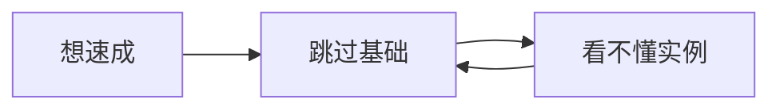

每次学新东西都又经历一遍：


```mermaid
graph LR;
	a[想速成]
	b[跳过基础]
	c[看不懂实例]
	a-->b-->c-->b;
```

```flow
st=>start: 速成
op=>operation: 基础
op1=>operation: 遇到看不懂的知识
cond=>condition: 补基础？
e=>end: 继续
st->op->op1->cond
cond(yes)->op
cond(yes,right)->op
cond(no)->e
```


